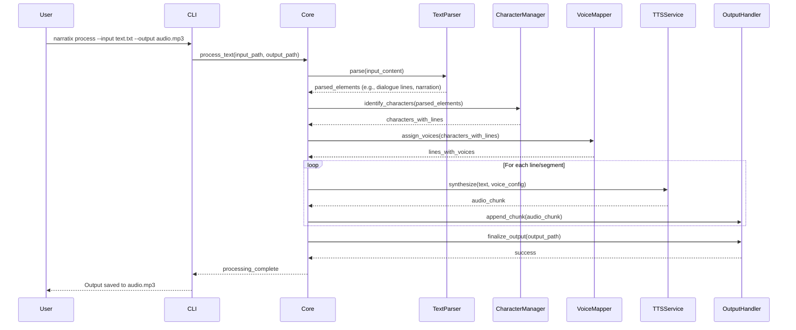

# Sequence Diagram Example: Processing a Text Snippet via CLI

This diagram illustrates the typical flow when a user processes a text snippet using the Command Line Interface (CLI).

**Description:**

1.  The User invokes the `narratix` CLI command.
2.  The CLI parses arguments and calls the main processing function in the Core module.
3.  The Core orchestrates the process: parsing text, identifying characters, assigning voices.
4.  For each segment needing audio, the Core calls the TTS Service.
5.  Audio chunks are assembled by the Output Handler.
6.  Finally, the complete audio file is saved, and the user is notified. 