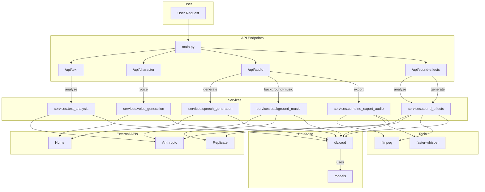

# Application Flow

This document outlines the architecture and data flow of the Narratix application.

## High-Level Overview

The application is a Python-based backend that provides an API for text-to-audio conversion. It uses a variety of services and external APIs to analyze text, generate speech, create background music, and add sound effects.

The application is built using FastAPI and communicates with a database (likely PostgreSQL) via SQLAlchemy.

Below is a diagram that shows the overall architecture of the application.

## Components

### API Endpoints

The application exposes a set of API endpoints for interacting with the system. The entry point is `main.py`, which sets up the FastAPI application and includes routers for different functionalities.

-   `/api/text`: Handles text creation and analysis.
-   `/api/character`: Manages characters, including voice generation.
-   `/api/audio`: Deals with audio generation, background music, and exporting the final audio.
-   `/api/sound-effects`: Manages sound effect analysis and generation.

### Services

The core logic of the application is encapsulated in a number of services.

-   `services.text_analysis`: This service is responsible for analyzing a given text to identify characters and split the text into dialogue and narrative segments. It uses the **Anthropic** API for this purpose.
-   `services.voice_generation`: This service generates voices for the characters identified in the text analysis phase. It uses the **Hume** API to create and manage these voices.
-   `services.speech_generation`: This service generates the actual speech for each segment of the text using the voices created by the `voice_generation` service. It also uses the **Hume** API.
-   `services.background_music`: This service generates background music for the text. It uses the **Anthropic** API to generate a prompt for the music and then the **Replicate** API to generate the music itself.
-   `services.combine_export_audio`: This service is responsible for combining all the generated audio components (speech, background music, sound effects) into a single audio file. It uses `ffmpeg` for audio manipulation and `faster-whisper` for word-level timestamp generation (force alignment).
-   `services.sound_effects`: This service analyzes the text to find opportunities for sound effects. It uses the **Anthropic** API for analysis and the **Replicate** API to generate the sound effects. `ffmpeg` is used for audio manipulation.

### External APIs

The application relies on several external APIs to provide its functionality.

-   **Anthropic**: Used for natural language processing tasks, such as text analysis, character extraction, and generating prompts for background music and sound effects.
-   **Hume**: Used for voice generation and speech synthesis.
-   **Replicate**: Used for generating background music and sound effects.

### Database

The application uses a database to store all its data. It interacts with the database through `db.crud` functions, which use SQLAlchemy models defined in `db.models`.

### Tools

-   **ffmpeg**: A command-line tool for manipulating audio and video. It's used for combining audio files, adding background music, and other audio processing tasks.
-   **faster-whisper**: A library for speech-to-text and force alignment, used to generate word-level timestamps for the audio.

## Data Flow

1.  A user sends a request to one of the API endpoints.
2.  The endpoint calls the appropriate service to handle the request.
3.  The service may interact with external APIs (Anthropic, Hume, Replicate) to perform its tasks.
4.  The service also interacts with the database via `db.crud` to store and retrieve data.
5.  For audio processing, services may use tools like `ffmpeg` and `faster-whisper`.
6.  The result is returned to the user through the API endpoint.

For example, a typical flow for generating a complete audio track from a piece of text would be:

1.  The user sends the text to the `/api/text` endpoint to create a new text entry.
2.  The user calls the `/api/text-analysis/{text_id}/analyze` endpoint to trigger the text analysis. The `text_analysis` service is called, which uses the Anthropic API to identify characters and segments. The results are stored in the database.
3.  The user calls `/api/character/{character_id}/voice` for each character to generate a voice. This calls the `voice_generation` service, which uses the Hume API.
4.  The user calls `/api/audio/text/{text_id}/generate` to generate the speech for all segments. This calls the `speech_generation` service, which uses the Hume API.
5.  Optionally, the user can call `/api/background-music/{text_id}/process` to generate background music and `/api/sound-effects/analyze/{text_id}` to find and generate sound effects.
6.  Finally, the user calls `/api/export/{text_id}/final-audio` to combine all the audio elements into a final track. This calls the `combine_export_audio` service. 